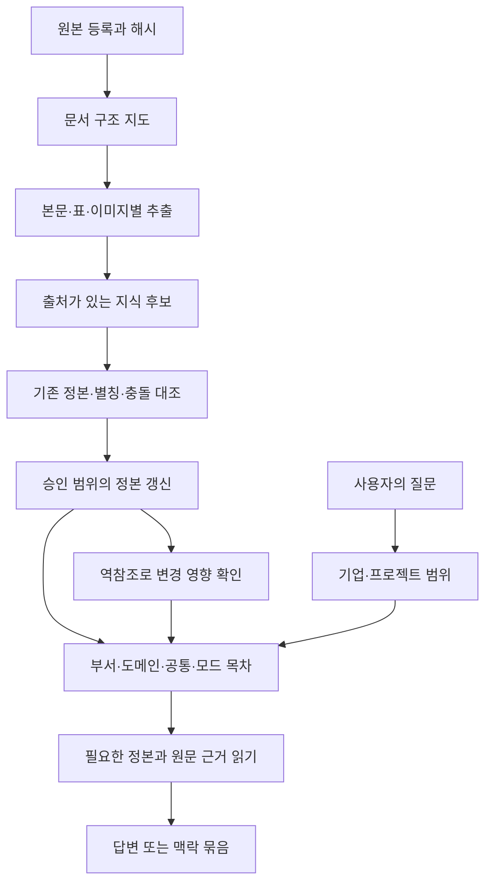

# IngesTiger LLM Wiki 개편 제안

## 풀 문제와 선택

많은 문서를 한 번에 읽어 요약하는 것만으로는 기업의 업무 맥락이 유지되지 않는다. 파일 하나에는 여러 부서의 요구와 서로 다른 시점의 결정이 섞이고, 같은 요구가 다른 표 구조로 반복된다. 문서를 추가할 때마다 전체 요약을 다시 쓰면 누락, 의미 병합, 오래된 결론의 잔존이 생긴다.

권장안은 **원본을 보존하고, 지식 단위를 정본화하고, 여러 목차가 그 정본을 가리키는 LLM Wiki**다. 라우팅은 문서 변환을 위한 경로와 질문에 답하기 위한 읽기 경로를 분리한다. Graphify와 codegraph는 설계 참고이며 필수 의존성으로 설치하지 않는다.

현재 산출물은 역할 지시서와 실행 계약의 재작성, 플러그인 구조 제안이다. XLSX 구조 추출·LLM 요청 준비·응답 검증·후보 목차 생성 스크립트를 구현했다. 모델 API 자동 호출·정본 승격·동시 갱신·권한 검증 엔진은 아직 구현하지 않았다. 첨부 자료에 기반한 별도 로컬 Wiki 예시는 구조를 검토하기 위한 것이다.

## 정본 감사와 preserve/discard

감사 기준은 기존 역할, 스킬, README, 메타데이터, 연동 가이드, 상태 문서와 검사기다. 경로/용어 검색과 파일별 직접 읽기를 대조했다.

| 기존 위치 | 분류 | 유지할 정보 | 새 조치 |
|---|---|---|---|
| agent/role-directive.md | 스킬·메타와 목적 중복, 호스트 경로 결합 | 역할, 원본 보존, 동일 대상 병합 경계 | Wiki 역할로 전면 재작성. 실행 절차는 스킬 참조 |
| skills/ingestiger/SKILL.md | 구 목적의 실행 정본 | 정산, 원문 역추적, 격리, 멱등성, 불확실성 | LLM Wiki 수직 루프로 교체. 데이터 의미는 내부 references에 분리 |
| README.md | 스킬과 절차 재서술 | 사용자가 이해할 목적과 진입점 | 사용 예·개편판 상태·링크만 유지 |
| agent/meta.json | 역할의 긴 재서술, 버전 정본 | 에이전트 식별/호스트 필드 | 짧은 발견 정보와 정본 경로. 플러그인 버전과 검사로 동기화 |
| docs/soloforce2-integration.md | 구 경로·구 저장소 의존 | 실제로 경로 차이가 있었던 증거 | 구 문서는 보관. 현재 호스트 검증이 필요한 전환안 작성 |
| tasks/findings/progress | 과거 계획·검증, 서로 다른 시점 | 실패 사례와 외부 검증의 교훈 | archive에서 보존. 현재 실행 지침에서 제외 |
| scripts/idem.py | 계약과 구현 간 부분 불일치 | 해시 기반 재처리 개념 | 원본 이름을 키로 쓰고 converter 버전을 비교하지 않는 구현은 재사용 보류 |
| scripts/ledger.py | 구 상태/파일명 계약에 결합 | 독립 manifest와 대조한다는 원칙 | 새 stable ID·단위 정산에 맞춘 구현을 별도로 설계 |

버리는 것은 원본이나 실패 증거가 아니라 구 실행 전제다. RAG, BM25, 임베딩·벡터 저장소, 혼합 검색·top-k 적중, DB/Drive 미러는 새 핵심 루프에서 제외한다. 관련 구판 파일은 `archive/legacy-v0.5.2/`에 바이트 그대로 남겨 재검토할 수 있게 한다.

기존의 고객사 자료 전면 제외는 단일 공유 저장소라는 전제에서 나왔다. 새 제안에서는 사용자 지정 기업·프로젝트 작업공간 안에서 자료를 처리한다. 이것이 곧 다중 사용자 보안 구현은 아니며, 다른 기업에 대한 접근 차단은 실제 저장소/도구 계층에서 검증해야 한다.

## 두 가지 라우팅



**입력 라우팅**은 형식을 보고 파서를 고른 뒤 내용의 소유 범위와 의미 단위로 나눈다. XLSX에도 긴 프롬프트와 이미지가 들어가므로 ‘엑셀은 정형’이라는 한 번의 분류로 끝내지 않는다. 첫 목차에는 파일과 하위 구조, 읽은 범위, 이월 범위를 둔다.

**질문 라우팅**은 허용된 단일/복수 기업·프로젝트 → 유사 패턴/부서/도메인/공통/목적 → 정본 ID → 상세 조건과 근거 좌표로 좁힌다. 여러 기업의 자료 대조 업무를 같은 패턴으로 호출할 수 있고 각 기업의 입력·검수 규칙은 별도 유지한다. 전체 문서를 프롬프트에 붙이지 않고 필요한 원문 범위만 확장한다. 예산 초과로 읽지 않은 자료는 관련 없는 자료로 오판하지 않는다.

‘업무 도메인’과 ‘산업 도메인’을 구분한다. 금융/반려동물/수면은 산업·주제 맥락이고, 광고 제작/상품 기획/주문·물류/교육 운영은 업무 과정이다. 회사명·부서명·도메인·목적을 하나의 폴더 분류 축으로 억지로 합치지 않는다.

## Wiki의 정본 단위

문서 한 개가 아니라 사실·요구·결정 단위에 안정적인 ID를 부여한다. 예를 들어 ‘광고소재 제작’이라는 같은 제목도 디자인의 이미지 품질 요구, 마케팅의 성과 분석, 영상의 최종 전달은 각기 다른 니즈다. 이들은 공통 과정에 연결하되 하나로 병합하지 않는다.

정본에는 출처 판, 셀·문단·페이지 좌표, 명시/추론 구분과 현재 유효성을 둔다. 상세 필드는 [데이터 계약](../skills/ingestiger/references/contracts.md)이 정본이다. 목차에는 식별자·제목·읽어야 할 이유만 두고 사실 값을 재작성하지 않는다.

공통 니즈에는 관련 부서별 근거가 필요하다. ‘디자인팀 내 공통 지원’이라는 원문 표현은 전사 공통이라는 뜻이 아니다. 협업 흐름이 확인되면 공통 과정 후보를 만들고, 담당·입력·승인 방식이 다른 부분은 개별 니즈에 남긴다.

## 참고 프로젝트에서 가져올 것

| 참고 | 채택 | 채택하지 않을 것 |
|---|---|---|
| paperthin ssotize | 한 사실 한 정본, 사본 지도, 고유 정보 보존, 충돌과 병합 승인 | 요약 파일을 늘리는 것 자체를 지식 구축으로 취급 |
| paperthin re0-work | 검증된 계약·실패 사례를 보존하고 첫 수직 루프부터 검증 | 기존 검색 적재 구조의 이름만 Wiki로 변경 |
| Graphify | 구조/의미 추출 분리, 근거 있는 관계, 명시/추론/불명확 구별, 해시 캐시 | 그래프 군집·연결 수를 조직의 공식 분류·권위로 간주 |
| codegraph | 명시적 개체/의존관계, 변경한 단위만 갱신, 역방향 영향 추적, 선택적 맥락 | 코드 AST 분석기를 XLSX 처리기로 간주하거나 검색 엔진을 함께 도입 |
| mattpocock ADR | 승격된 스킬만 명시 경로로 배포, 초안·은퇴 분리 | 설치 호환성을 시험하지 않은 채 보장하거나 스킬 복사본을 수동 유지 |

Graphify는 문서·미디어의 의미 추출도 다루지만 codegraph의 주 대상은 소스코드다. 정형 업무표에는 시트·테이블·행·열·업무 키를 읽는 별도 어댑터가 필요하다. 두 참고 도구의 성능 수치를 이 시스템의 성능으로 옮겨 쓰지 않는다.

## GitHub 구조

```text
.claude-plugin/
  plugin.json                     # 버전 및 배포 스킬 목록 정본
  marketplace.json                # 이 저장소를 직접 읽는 선택적 배포 입구
.agents/adr/0001-wiki-plugin.md    # 구조 결정
AGENTS.md                         # 기여자와 에이전트용 정본 지도
CLAUDE.md                         # AGENTS.md 진입점
README.md                         # 사용자를 위한 안내
agent/
  role-directive.md               # 역할 정본
  meta.json                       # 호스트 발견 정보
skills/ingestiger/
  SKILL.md                        # 실행 절차 정본
  references/contracts.md         # 데이터·갱신 계약
  references/modes.md             # 네 목적별 읽기·출력 계약
  references/structure.md         # ASCII ERD와 간략 요약의 생성 규칙
scripts/validate_layout.py        # 경로·배포 목록·버전 검사
scripts/query_fixture.py          # 로컬 데이터로 패턴·권한 범위 필터를 시험
docs/
  proposal.md                     # 이 제안
  soloforce2-integration.md       # 호스트 전환 제안
archive/legacy-v0.5.2/             # 원본 구현·검증 기록 보존
```

플러그인 버킷을 많이 만들 이유가 아직 없다. 첫 완결 단위는 `ingestiger` 하나로 두고 네 활용 목적은 참조 문서로 선택한다. 이후 독립적으로 호출하고 검증할 필요가 입증된 기능만 별도 스킬로 승격한다.

## 추가·수정의 처리

수정 파일을 발견하면 바뀐 원문 단위 → 그 근거를 참조한 정본 → 역참조 목차/산출물만 추적한다. 제목·행 번호·내용 해시를 ID로 사용하면 작은 편집에도 링크가 바뀌므로 stable ID와 revision을 분리한다.

새 파일의 유사 문장을 기존 정본에 강제로 합치지 않는다. 같은 요구인지, 세부 요구가 추가됐는지, 이전 결정을 바꾸는지, 이해관계자 의견이 다른지를 비교한다. ‘가장 최근 파일 우선’은 사용하지 않는다.

정본과 목차를 작업판에서 함께 만들고 검증된 snapshot만 현재판으로 승격한다. 중간 실패와 동시 수정은 base revision으로 감지한다. 실제 구현 전에는 파일 여러 개를 편집한 결과를 원자적 갱신이라 부르지 않는다.

## 첫 구현과 검증 순서

1. **구조 추출과 등록.** XLSX 희소 셀·DOCX 문단/표·PDF 암호 상태를 기록하고 원본 좌표를 만든다. 네 테스트 자료를 모두 정산한다. 미열람 PDF도 사라지면 안 된다.
2. **한 니즈의 완결 루프.** 두 문서에 있는 같은 요구를 후보로 대조하고 고유 메모를 보존한다. 승인된 정본 1개를 네 모드에서 참조한다. 다른 요구와의 거짓 병합을 검증한다.
3. **실제 읽기.** 새 에이전트가 START에서 부서 니즈와 근거를 찾는지 시험한다. 원본에서 작성한 질문, 오답/미존재 질문, 다른 기업 질문을 쓴다.
4. **갱신.** 피드백 추가, 행 삽입, 파일 이름 변경, 원본 삭제 감지, 충돌, 쓰기 중 실패, 동시 수정에서 정본 ID와 현재판을 검증한다.
5. **규모.** 그 후에 큰 배치의 이월·재개·예산 제한을 구현한다. 파일 수만 늘린 복제 데이터는 실제 다양한 문서의 정확도를 증명하지 못한다.
6. **호스트 배포.** 플러그인 설치와 Soloforce2 loader를 실제로 실행하고, 조직 접근권한과 런타임 경로를 검증한다.

첫 품질 게이트는 ‘하나의 니즈가 원본 두 곳과 새 피드백을 거친 후에도 근거·ID·모드 간 일관성을 유지하는가’다. 현 제안의 로컬 예시는 이 경로의 구조를 보여주며, 자동 엔진의 통과 증거는 아니다.

측정은 누락 단위 수, 거짓 병합 수, 끊어진 링크 수, 원문 근거 일치율, 다른 기업 정보 노출 수, 오래된 뷰 수, 읽은 토큰/파일 수와 작업시간으로 한다. 정확도 검증은 생성한 요약에서 만든 정답이 아니라 사람이 원본을 읽고 확정한 별도 질문 세트로 수행한다.

## 남은 결정

기업/프로젝트의 실제 등록 ID, 정본 승인 권한, 실행 호스트의 접근정책과 저장 위치는 배포 전에 정해야 한다. 암호화된 금융 교육 PDF를 읽기 전에는 금융 부서별 니즈를 추정해 채우지 않는다. 다른 주제의 원고도 파일명만으로 같은 기업에 귀속시키지 않는다.

추가된 금융 요구 XLSX는 별도 원본으로 처리한다. PDF의 내용 확인 상태를 바꾸지 않으며 여러 계열사의 요구를 소유 범위별로 나눠 패턴 조회를 시험한다. 로컬 fixture에서 40개 원본 요구 블록을 56개 명시적 하위 절로 분리한 사례를 제공한다. 이는 단어/구조 기반 분류와 범위 필터의 실행 검증이며 인증·저장소 ACL·의미 분류 정확도의 운영 검증은 아니다.

Wiki 생성 결과에는 별도 STRUCTURE.md를 포함한다. 논리 ASCII ERD, 실제 기업/부서 구성, 원본과 하위 절의 수, 유사 패턴과 네 모드, 보류 상태를 같은 snapshot 기준으로 보여준다. 표현 규칙은 [구성 표현 규칙](../skills/ingestiger/references/structure.md)에 둔다.

## 근거

- [paperthin](https://github.com/LilMGenius/paperthin): 현재 checkout의 28개 SKILL.md 전수 읽기. 별도 검토 기록에 경로·전체 SHA-256을 남겼다.
- [Graphify 구조와 추출](https://github.com/Graphify-Labs/graphify/blob/v8/docs/how-it-works.md)
- [codegraph README](https://github.com/colbymchenry/codegraph)
- [플러그인 배포 ADR](https://github.com/mattpocock/skills/blob/main/.agents/adr/0002-ship-as-a-claude-code-plugin.md)

## 실행 분담 구현

현재 구현 범위와 Graphify의 선택적 위치는 [실행 계약](../skills/ingestiger/references/execution.md)에 둔다. 스킬 내부 `scripts/pipeline.py`를 배포하여 호스트 LLM과 파일 요청/응답으로 연결한다. 의미 판단을 정규식으로 대체하지 않는다.

## 이미지 샘플과 큰 발표자료

이미지 golden sample은 원본·최소 정보만 저장하고 필요할 때 참조하도록 변경했다. 이전 선행 비전 분석·평가 기준 자동 생성은 현행 경로에서 제외했다. [저장 계약](../skills/ingestiger/references/golden-samples.md)이 정본이다. [발표자료 계약](../skills/ingestiger/references/large-decks.md)에 따라 대용량 Keynote/PPTX의 컨테이너와 매체 구성을 먼저 점검한다. 현재 구현은 inventory와 PPTX 순서 목록까지이며 Keynote 변환·슬라이드 의미 분석은 보류 단계다.

추가한 [원본 품질 계약](../skills/ingestiger/references/source-quality.md)은 HWP/HWPX 등 예외의 처리 상태를 명시한다. sanitized Sheets용 링크 감사 CLI를 구현했으며 네트워크 자동 검사와 HWP/HWPX는 원본의 Kordoc을 기본 어댑터로 지정했으며 실제 연결·변환은 아직 검증하지 않았다.

전체 상위 과정은 [실행 계약](../skills/ingestiger/references/execution.md)의 가져오기 → 분해하기 → 저장하기를 따른다. 개별 스크립트와 통합 자동 실행기의 구현 상태를 구분한다.

## 현재 지침의 시작점

역할·스킬·실행 계약을 가져오기 → 분해하기 → 저장하기 중심의 v0로 재구성했다. 도구별 선택은 [어댑터 경로](../skills/ingestiger/references/adapters.md), 명령은 [운영 문서](../skills/ingestiger/references/runbook.md)가 관리한다. 위 설계·실험 이력은 현재 구현 완료를 의미하지 않는다.
